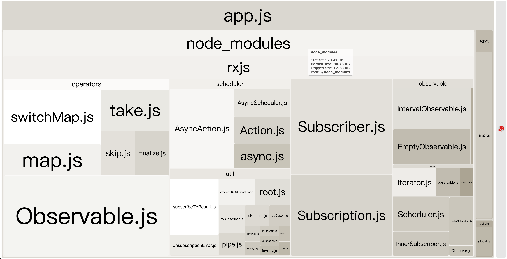

# RxJS Treeshaking example with Webpack & ts-loader

## Config File

see [webpack.config.js](./webpack.config.js)

```ts
const { resolve } = require('path')
const webpack = require('webpack')
const BundleAnalyzerPlugin = require('webpack-bundle-analyzer').BundleAnalyzerPlugin
const tsImportPluginFactory = require('ts-import-plugin')

const importPlugin = tsImportPluginFactory({
  libraryName: 'rxjs/operators',
  style: false,
  libraryDirectory: '',
  camel2DashComponentName: false,
  transformToDefaultImport: false
})

module.exports = {
  entry: {
    app: './src/app.ts'
  },
  output: {
    filename: '[name].js',
    path: resolve(process.cwd(), 'dist')
  },
  resolve: {
    extensions: ['.tsx', '.ts', '.js', '.jsx']
  },
  module: {
    rules: [
      {
        test: /\.(jsx|tsx|js|ts)$/,
        loader: 'ts-loader',
        options: {
          transpileOnly: true,
          getCustomTransformers: () => ({
            before: [ importPlugin ]
          })
        },
        exclude: /node_modules/
      }
    ]
  },

  plugins: [
    new webpack.DefinePlugin({
      'process.env.NODE_ENV': JSON.stringify(process.env.NODE_ENV)
    }),

    new webpack.HashedModuleIdsPlugin(),

    new webpack.optimize.UglifyJsPlugin({
      mangle: {
        screw_ie8: true
      },
      compress: {
        screw_ie8: true,
        dead_code: true,
        warnings: false
      },
      beautify: false,
      sourceMap: false,
      comments: false
    }),

    new BundleAnalyzerPlugin({
      analyzerMode: 'static',
      reportFilename: './report.html'
    })
  ]
}
```

## Build result


